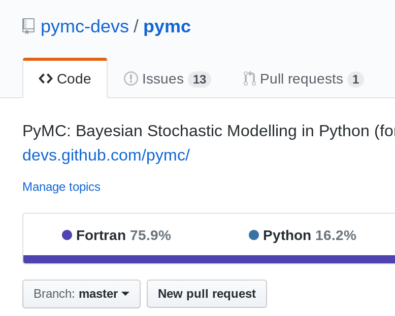

---?image=assets/img/framing_model.png&opacity=10
@title[Title Slide]

@snap[north-west]
## **PyMC's Big Adventure**

#### **Lessons Learned from the Development of Open-source Software for Probabilistic Programming**
@snapend

@snap[south-west byline text-orange]
#### **Chris Fonnesbeck, Vanderbilt University Medical Center**
Machine Learning Open Source Software 2018: Sustainable communities
@snapend

---
@title[PyMC3]

@snap[north-west]

<br><br><br><br>
@ul[square-bullets](false)
- started in 2003
- **probabilistic programming** framework
- based on Theano
- implements *next generation* Bayesian inference methods
- >100 contributors
@ulend
@snapend

@snap[north-west span-55]

@snapend

@snap[south-west byline text-orange]
Salvatier, Wiecki and Fonnesbeck (2016)
@snapend

---
@title[Origins]


---
@title[Motivation]

@snap[west span-100]
### @color[#E49436](Why PyMC?)

<br> 
#### **Bayesian modeling for @color[#E49436](applied) users @fa[smile-o]**
@snapend

---?image=assets/img/winbugs.jpg&opacity=40

@snap[north headline]
## WinBUGS
@snapend

---

```r
model {
     for (j in 1:J){
       y[j] ~ dnorm (theta[j], tau.y[j])
       theta[j] ~ dnorm (mu.theta, tau.theta)
       tau.y[j] <- pow(sigma.y[j], -2)
     }
     mu.theta ~ dnorm (0.0, 1.0E-6)
     tau.theta <- pow(sigma.theta, -2)
     sigma.theta ~ dunif (0, 1000)
   }

```

---?image=assets/img/pymc_1.png&size=auto 70%

@snap[north]
### PyMC @color[#E49436](1.0)
@snapend

Note:

- heavy object oriented implementation
- goal: generality


---
@title[PyMC2]

### And Then There Were Three ...

@div[left-50]
<br><br>

<br>Anand Patil
@divend

@div[midpoint]
<br><br>

<br>Me 
@divend

@div[right-50]
<br><br>

<br>David Huard 
@divend

---
@title[PyMC2 Features]


---
@title[FORTRAN]



---
@title[HMC]

## Hamiltonian Monte Carlo


---
@title[John's Blog Post]

> I’m not sure why this approach seems neglected. It might be that research incentives don’t reward such generally applicable research, or that MCMC researchers do not see how simplified MCMC could dramatically improve the productivity of statistics, or perhaps researchers haven’t realized how automatic differentiation can democratize these algorithms.

---
@title[PyMC3]


---

@snap
`\begin{align}
&\beta_{0,i} \sim N(0, 10000) \\
&\beta_1 \sim N(0, 10000) \\
&\sigma \sim \text{HalfCauchy}(5) \\
&\theta_i = \beta_{0,i} + \beta_1 x_i \\
&y_i \sim N(\theta_i, \sigma) 
\end{align}`
@snapend

---

```
with Model() as unpooled_model:
    
    β0 = Normal('β0', 0, sd=1e5, shape=counties)
    β1 = Normal('β1', 0, sd=1e5)
    σ = HalfCauchy('σ', 5)
    
    θ = β0[county] + β1*floor
    
    y = Normal('y', θ, sd=σ, observed=log_radon)
```

---
@title[Crisis]

@snap[north-west]
# PyMC3 in Crisis!
@snapend

---?image=assets/img/photo.jpeg&size=auto 90%
@title[Theano's Demise]

---
@title[Keys to Success]


---
@title[Pro Tips]


Note:

- software for remote teams: Slack

---
@title[Building a Culture]

### Project Culture

Note:

- Monthly lab meetings
- Journal club
- Face-to-face meetings

---
### PyMC 