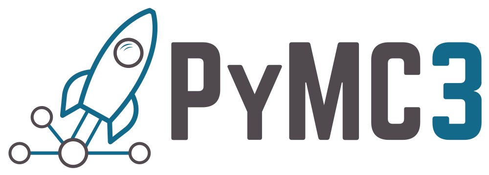

---?image=assets/img/bayes_nn.png&opacity=20&size=auto 190%
@title[Title Slide]

@snap[north-west]
## **PyMC's Big Adventure**

#### *Lessons Learned from the Development of Open-source Software for Probabilistic Programming*
@snapend

@snap[south-west byline text-orange]
#### **Chris Fonnesbeck, Vanderbilt University Medical Center**
Machine Learning Open Source Software 2018: Sustainable communities
@snapend

---
@title[PyMC3]

@snap[north-west]

<br><br><br><br>
@ul[square-bullets](false)
- started in 2003
- **probabilistic programming** framework
- based on Theano
- implements *next generation* Bayesian inference methods
- >100 contributors
@ulend
@snapend

@snap[north-west span-55]

@snapend

@snap[south-west byline text-orange]
Salvatier, Wiecki and Fonnesbeck (2016)
@snapend

---?image=assets/img/pydata.png&size=auto 90%
@title[PyData]

---
@title[Applications]

@snap[north-west span-50]
### PyMC3 in the Wild

@ul[](false)
- Astronomy
- Biostatistics
- Ecology
- Chemistry
- Finance
- Economics
- Sabermetrics
- Marketing
- Actuarial Science
@ulend
@snapend

@snap[east span-50]

@size[0.3em](MacNeil *et al.* 2016 "Joint estimation of crown of thorns *Acanthaster planci* densities on the Great Barrier Reef") 
@snapend

---?image=assets/img/pitch_framing.png&size=auto 70%
@title[PyMC3 Model]


---
@title[Motivation]

@snap[west span-100]
### **@color[#E49436](Why) PyMC?**

<br> 
#### **Bayesian modeling for @color[#E49436](applied) users @fa[smile-o]**
@snapend

---?image=assets/img/winbugs.jpg&opacity=40
@title[WinBUGS]

@snap[north headline]
## WinBUGS
@snapend

---
@title[BUGS Code]

```r
model {
     for (j in 1:J){
       y[j] ~ dnorm (theta[j], tau.y[j])
       theta[j] ~ dnorm (mu.theta, tau.theta)
       tau.y[j] <- pow(sigma.y[j], -2)
     }
     mu.theta ~ dnorm (0.0, 1.0E-6)
     tau.theta <- pow(sigma.theta, -2)
     sigma.theta ~ dunif (0, 1000)
   }

```

---?image=assets/img/pymc_1.png&size=auto 70%
@title[PyMC 1]

@snap[north]
### PyMC @color[#E49436](1.0)
@snapend

Note:

- heavy object oriented implementation
- goal: generality


---
@title[PyMC2]

### And Then There Were Three ...

@div[left-50]
<br><br>

<br>Anand Patil
@divend

@div[midpoint]
<br><br><br><br><br>

<br>Me 
@divend

@div[right-50]
<br><br>

<br>David Huard 
@divend

---
@title[PyMC2 Features]

@snap[north-east]

@snapend

@snap[west]
### @color[#2b8cbe](**PyMC2**)
@ul[text-10](false)
- Suite of well-documented statistical distributions.
- NumPy-based
- Gaussian processes module
- Robust sampling loops
- Suite of convergence diagnostics 
- Extensible: custom step methods and unusual probability distributions
- `f2py` FORTRAN extensions
@ulend
@snapend

@snap[south span-100 text-05]
@color[#2b8cbe](Patil, A., D. Huard, and  C.J. Fonnesbeck. 2010. Journal of Statistical Software 35 [4].)
@snapend

---
@title[FORTRAN]


---
@title[HMC]

### **Hamiltonian Monte Carlo**

Uses a *physical analogy* of a frictionless particle moving on a hyper-surface

Requires an *auxiliary variable* to be specified

- position (unknown variable value)
- momentum (auxiliary)

$$\mathcal{H}(s, \phi) = E(s) + K(\phi) = E(s) + \frac{1}{2}(\sum_i)\phi_i^2$$

---?image=assets/img/nuts_sample.png&position=center&size=auto 60%
@title[HMC Samples]

@snap[north-west]
### Efficient MCMC sampling
@snapend

@snap[south span-100 text-05]
@color[#2b8cbe](Hoffman and Gelman, 2014)
@snapend

---
@title[John's Blog Post]

@snap[west span-70]
@size[0.9em]("I’m not sure why this approach seems neglected. It might be that research incentives don’t reward such generally applicable research, or that MCMC researchers do not see how simplified MCMC could dramatically improve the productivity of statistics, or perhaps researchers haven’t realized how automatic differentiation can democratize these algorithms.")
@snapend


@snap[east]


#### @color[orange](John Salvatier)
@snapend

---
@title[PyMC3]

### PyMC Devs, The Next Generation

@div[left-50]
<br><br>

<br>John Salvatier
@divend

@div[midpoint]
<br><br><br><br><br>

<br>Me 
@divend

@div[right-50]
<br><br>

<br>Thomas Wiecki 
@divend


---
@title[Hierarchical Math]

@snap[north]
### Hierarchical Model
@snapend

@snap
`\begin{align}
&\beta_{0,i} \sim N(0, 10000) \\
&\beta_1 \sim N(0, 10000) \\
&\sigma \sim C^+(5) \\
&\theta_i = \beta_{0,i} + \beta_1 x_i \\
&y_i \sim N(\theta_i, \sigma) 
\end{align}`
@snapend

---
@title[Hierarchical Code]

### Hierarchical Model

```
with Model() as unpooled_model:
    
    β0 = Normal('β0', 0, sd=1e5, shape=counties)
    β1 = Normal('β1', 0, sd=1e5)
    σ = HalfCauchy('σ', 5)
    
    θ = β0[county] + β1*floor
    
    y = Normal('y', θ, sd=σ, observed=log_radon)
```

---?image=assets/img/bayes_whiteboard.png&size=auto
@title[Whiteboard]

---?image=assets/img/pymc_website.png&size=auto 90%
@title[PyMC3 Examples]

---
@title[MCMC]

## MCMC Sampling

<br><br>
```python
with pitch_framing_model:
    trace = pm.sample(1000, tune=1000)

Auto-assigning NUTS sampler...
Initializing NUTS using jitter+adapt_diag...
Multiprocess sampling (2 chains in 2 jobs)
NUTS: [σ_log__, ψ, μ]
100%|██████████| 2000/2000 [00:42<00:00, 47.42it/s] 
```

---
@title[Variational Inference]

## Variational Inference

<br><br>
```python
with neural_network:
    approx = pm.fit(n=30000, method='fullrank_advi')

Average Loss = 1,207.6: 100%|██████████| 30000/30000 [27:41<00:00, 18.06it/s]  
Finished [100%]: Average Loss = 1,206.2
```

---?image=assets/img/photo.jpeg&size=auto 90%
@title[Theano's Demise]

---?image=assets/img/fetal.jpg&size=auto 70%
@title[Sadness]

---?image=assets/img/pymc4_tweet.png&size=auto 90%
@title[PyMC4]

---
@title[Backend Choices]

@snap[north-east]

@snapend

@snap[north-west]

@snapend

@snap[midpoint]

@snapend

@snap[south-west]

@snapend

@snap[south-east thumbnail]

@snapend

---?image=assets/img/eightball.jpg&position=center&size=auto 100%
@title[The Future]

---?image=assets/img/numfocus.png&position=center&size=auto 55%
@title[NumFOCUS]

@snap[north]

@snapend

---?image=assets/img/gsoc.jpg
@title[Google Summer of Code]

---?image=assets/img/IMG_0055.JPG&size=auto 80%
@title[Lab Meetings]

---?image=assets/img/nicole_talk.jpg
@title[Give Talks]

---?image=assets/img/IMG_0077.JPG&position=right&size=auto 80%
@title[Building a Culture]

### Interaction and 
### Communication

- Monthly lab meetings
- Journal club
- Face-to-face meetings
- Slack channels
- Discourse site

---?image=assets/img/bayes_carry_out.jpg
@title[Final Slide]
